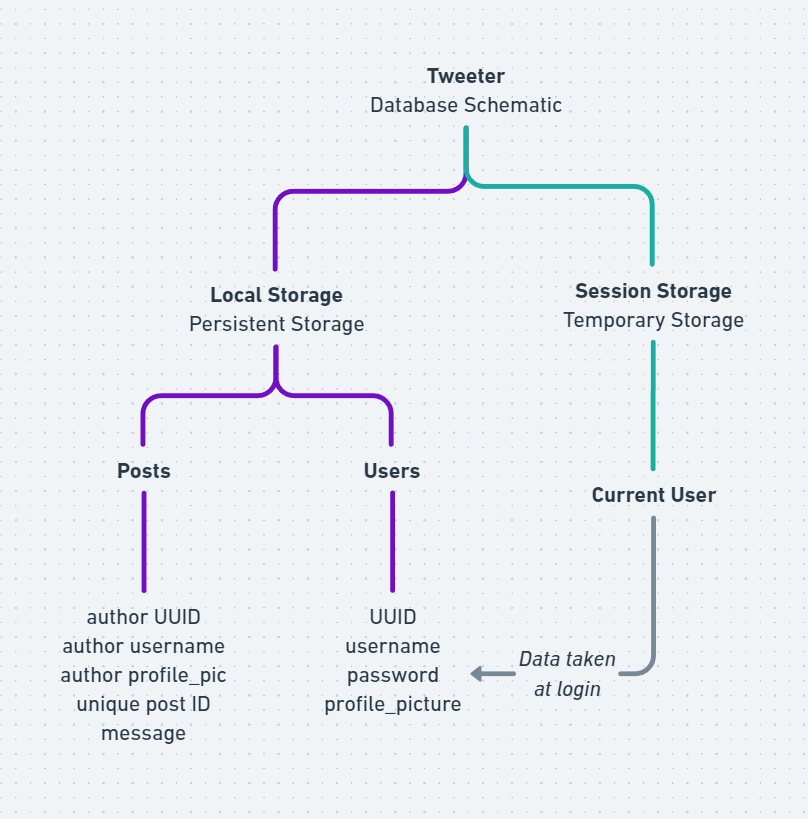

# Tweeter

Tweeter is a front-end project focused on delivering a real-time online chatting experience through the utilization of vanilla HTML, CSS and JS. 

## Pre-Requisites
- VS Code with the extension `Live Server`, to launch the project, launching the HTML through the regular file explorer window
- Github CLI on the desktop

## Installation

Clone the repository onto your local machine using git:

```bash
git clone https://github.com/Serpent03/tweeter.git
```

## Overview

The website consists of three pages:
- Register
- Login
- Home page with all the text message feed

 To use the website, do the following:

1. Register your account on the register page, and then log in using those credentials
2. The home page will be automatically opened, so you can begin to chat!

## The "Backend"

The website works on basis of `localStorage` and `sessionStorage`, which allows it to keep track of all previous posts and also keep track of the current user operating the website.

